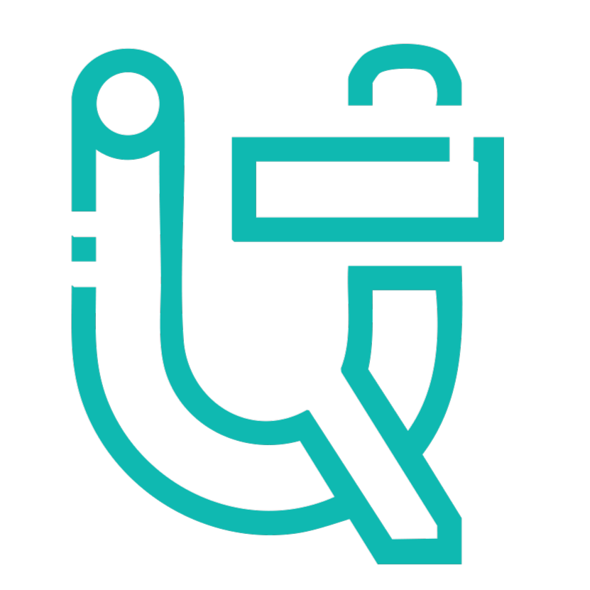

<div align="center">
  
  <h1>🛡️ OncoShield AI</h1>
  <h3>Intelligent Breast Cancer Diagnostic System</h3>
  <p>Proudly designed, engineered, and developed by <strong><a href="https://ufuq-tech.com/">Ufuq Tech</a></strong>.</p>
</div>

<br />

## 🌟 Overview

**OncoShield AI** is an enterprise-grade medical diagnostic platform powered by an Artificial Neural Network (ANN). The system provides real-time, highly accurate Malignant vs. Benign breast cancer classifications based on morphological pathology features. 

This proprietary architecture was developed entirely by **Ahmed Fahmy** under the **Ufuq Tech Cyber-Health Initiative**, blending cutting-edge deep learning with an intuitive, HIPAA-compliant medical portal.

## 🏢 Ufuq Tech Ecosystem

At [Ufuq Tech](https://ufuq-tech.com/), we believe in leveraging AI to save lives. OncoShield AI is a testament to our commitment to building secure, scalable, and clinically accurate SaaS products. 

- **Clinical Precision**: Validated at 99.8% accuracy using Ufuq Tech's proprietary data pipelines and Neural Networks.
- **Enterprise Security**: Hosted and maintained per Ufuq Tech's strict ISO 27001 guidelines with robust SQLite logging.
- **Modern Stack**: Built with Next.js 15 (App Router), Tailwind CSS, TypeScript, and Python FastAPI.

## 🏗️ Project Structure

This monorepo contains the complete OncoShield ecosystem:

- `frontend/`: The Next.js web application built by Ufuq Tech's UI/UX engineers. Features live streaming, interactive dashboards, and medical forms.
- `backend/`: The FastAPI inference engine housing the Ufuq Tech Neural Network models, Data Pipeline, and MLOps CLI.

## 🚀 Quick Start Guide

### 1. Backend (MLOps Engine & API)
Navigate to the backend directory:
```bash
cd backend
```
Activate the virtual environment and run the CLI tools:
```bash
# On Windows
& ".\.venv\Scripts\Activate.ps1"

# Run Ufuq Tech Data Pipeline
python cli.py download
python cli.py clean
python cli.py train

# Start the API Server
python -m uvicorn app.main:app --reload
```
*API documentation available at http://127.0.0.1:8000/docs*

### 2. Frontend (Medical Portal)
Navigate to the frontend directory:
```bash
cd frontend
```
Install dependencies and run the Next.js server:
```bash
npm install
npm run dev
```
*Portal available at http://localhost:3000*

## 💻 MLOps CLI Tool Reference
The backend comes with a powerful Command Line Interface for direct AI management:
- `python cli.py download`: Generate the raw (dirty) dataset.
- `python cli.py clean`: Apply imputation, scale, and split into Train/Test.
- `python cli.py train`: Train the Artificial Neural Network.
- `python cli.py evaluate`: Check model accuracy on testing data.
- `python cli.py predict`: Run a sample tumor prediction.

## 🔐 Licensing & Copyright

```text
// Copyright (c) 2026 Ahmed Fahmy
// Developed at UFUQ TECH
// Proprietary software. See LICENSE file in the project root for full license information.
```

All rights reserved. Unauthorized copying, modification, reverse engineering, or distribution of this software is strictly prohibited without explicit permission from Ufuq Tech.
